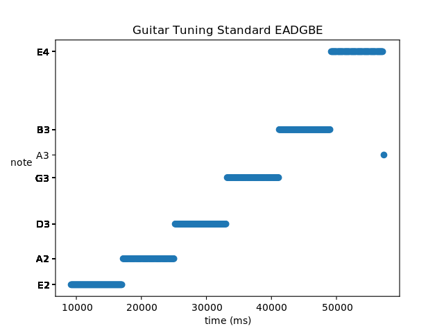

# transcribe

## transcribe music

Transcribe audio files.

Transcribe will chop the music up into time slices and detect the pitch of the raw audio data of each slice using the [McLeod pitch method](http://miracle.otago.ac.nz/tartini/papers/A_Smarter_Way_to_Find_Pitch.pdf).

```
(transcribe-venv) sevagh:transcribe $ ./transcribe.py /home/sevagh/repos/transcribe/'Guitar Tuning Standard EADGBE-bKS_m7JObxg.m4a'
```



### System dependencies

This project uses Conda.

On Fedora: `sudo dnf install cairo-devel libffi-devel python3-tkinter ffmpeg ffmpeg-devel`
