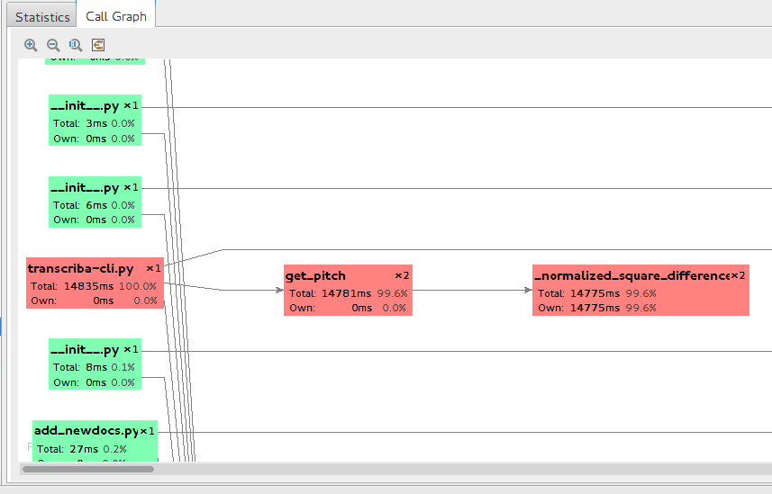
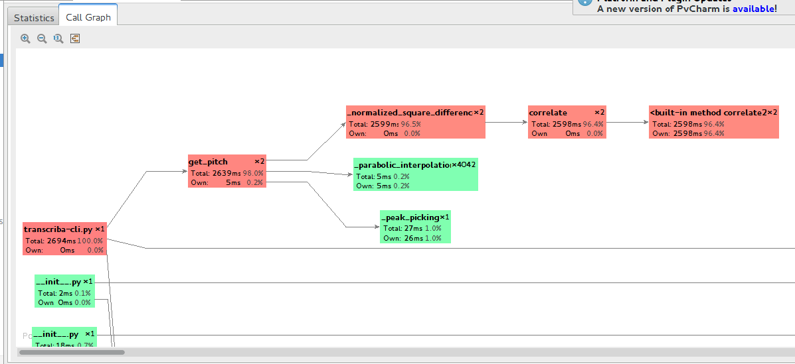

Speeding up real-time pitch detection with FFT autocorrelation
==============================================================

[2015-09-06] Replacing time-domain autocorrelation with numpy FFT autocorrelation
---------------------------------------------------------------------------------

I first used the McLeod Pitch Method in my Android real-time pitch detection app, [pitcha](https://github.com/sevagh/Pitcha). Here are several resources on the McLeod Pitch Method, including the original paper by Philip McLeod:

* [McLeod's paper](http://miracle.otago.ac.nz/tartini/papers/A_Smarter_Way_to_Find_Pitch.pdf)
* [Summary of modern pitch detection techniques](https://sites.google.com/site/musicaudiohp/pitch-detection-overview)
* [Deeper look at MPM](http://www.katjaas.nl/helmholtz/helmholtz.html)

At its core, MPM is based on autocorrelation. Originally, I modified an implementation from the [TarsosDSP project](https://github.com/JorenSix/TarsosDSP). The performance was sufficient with the small data arrays (4096) that I was capturing from the Android microphone, but during recent experiments I was disappointed with the performance with larger array sizes (44100).

### Time-domain normalized autocorrelation

Original code with time-domain autocorrelation:

    def _normalized_square_difference(self, audio_buffer):
        length_audio_buffer = len(audio_buffer)
        median = np.median(np.array(audio_buffer))
        for tau in range(0, length_audio_buffer):
            acf = 0
            divisor_m = 0
            for i in range(0, length_audio_buffer - tau):
                acf += (audio_buffer[i]-median) * (audio_buffer[i + tau]-median)
                divisor_m += (audio_buffer[i]-median) * (audio_buffer[i]-median) +
                             (audio_buffer[i + tau]-median) * (audio_buffer[i + tau]-median)
            if divisor_m != 0:
        self._nsdf[tau] = 2 * acf / divisor_m

Profiler snapshot with a buffer size of 44100:

### FFT normalized autocorrelation

FFT autocorrelation, using the numpy implementation:

    def _normalized_square_difference(self, audio_buffer):
        audio_buffer -= np.mean(audio_buffer)
        autocorr_f = np.correlate(audio_buffer, audio_buffer, mode='full')
        with np.errstate(divide='ignore', invalid='ignore'):
            self._nsdf = np.true_divide(autocorr_f[autocorr_f.size/2:],
                                        autocorr_f[autocorr_f.size/2])
            self._nsdf[self._nsdf == np.inf] = 0
            self._nsdf = np.nan_to_num(self._nsdf)

Profiler snapshot with a buffer size of 44100:

A factor 6 improvement was achieved. In the future I would like to experiment with GPGPU (e.g. PyCUDA) for more performance gains. Also, I wonder if machine learning can be applied to pitch detection to improve results.
