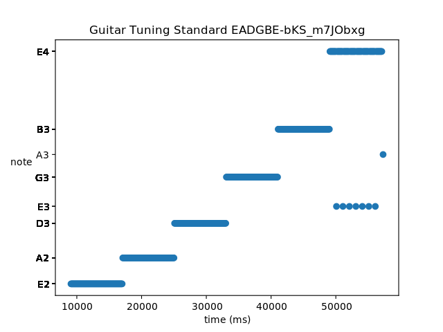

Packaging Python code with XAR
==============================

[2018-07-14] Using the Facebook XAR (executable archive based on SquashFS) to package Python in a single file
-------------------------------------------------------------------------------------------------------------

### Motivation

I read about XARs on [HackerNews](https://news.ycombinator.com/item?id=17524086), which contained a link to the Facebook [blog post](https://code.fb.com/data-infrastructure/xars-a-more-efficient-open-source-system-for-self-contained-executables/).

Reading through the post is worthwhile. This sentence sums up the use of the tool:

>XARs, like PARs, also have advantages for interpreted languages like Python. By collecting a Python script, associated data, and all native and Python dependencies, we achieve a hermetic binary that can run anywhere in our infrastructure, regardless of operating system or packages already installed. 

This sounds like a solution to probably the biggest Python painpoint I (and others) face - distribution of Python applications, clashes with pip, virtualenvs, system packages, user packages, etc.

It's for this reason that I write a lot of sysadmin/operations tooling (at $WORK) in Go - for the ease of building "hermetic" binaries. I actually really like writing Python and upon seeing XAR, was excited to evaluate a possible method of releasing Python "self-contained binaries."

### Transcribe's layout - before XAR

Before touching any XAR things, my project had the following Python project files:

* environment.yml for conda (https://conda.io/docs/user-guide/tasks/manage-environments.html)
* requirements-pip.txt for packages only available through pip
* requirements-conda.txt for packages installable through conda

The `requirements-*.txt` files were useful *before* I had an `environment.yml` file, to faciliate the setting up of the conda environment. Once the environment file exists, however, it contains all the information from the requirements files:

```
dependencies:
  - conda_package_1=vers2
  - conda_package_2=vers2
  - pip:
    - pip_package_1==vers1
    - pip_package_2==vers1
```

This way I could get delete the `requirements-*.txt` files. The original motivation for using conda was to use a specific dev snapshot of Numba - I describe it [here](http://sevag.xyz/post/snac2/#conda).

### The lazy (and bad) decision to not write a setup.py

I have a bad tendency to not write `setup.py` files. I prefer pip requirements files usually. I did not have enough curiosity to challenge my own preconceptions of a good Python "workflow." Since pip is easy for me, that's all I ever released.

It seems like pip (and conda) are dev environment setup tools, and setup.py is for distribution. This is an important distinction, and it reflects my attitude of "when I release on GitHub, I expect people to completely understand my workflow and thus I don't need to pay attention to distribution."

### Writing a setup.py file

I copy-pasted the PyPa [sample](https://github.com/pypa/sampleproject/blob/master/setup.py) to come up with the following `setup.py` file (boilerplate stuff omitted):

```python
setup(
    ... 
    install_requires=[
        "matplotlib",
        "numpy",
        "scipy",
        "llvmlite",
        "numba",
        "cairocffi",
        "pydub",
    ],
    extras_require={"dev": ["black", "profilehooks", "xar"]},
    packages=find_packages(exclude=["contrib", "docs", "tests"]),
    entry_points={"console_scripts": ["transcribe=transcribe.__main__:main"]},
)
```

I also got some help with the `entry_points:{"console_scripts"}` section form the [following blog post](https://chriswarrick.com/blog/2014/09/15/python-apps-the-right-way-entry_points-and-scripts/).

This had me convert my project layout from:

```
(transcribe-venv) sevagh:transcribe $ tree -L 1
.
├── transcribe      # directory with python sources
├── transcribe.py   # if __name__ == '__main__' entrypoint script
```

to this:

```
(transcribe-venv) sevagh:transcribe $ tree -L 2 transcribe
transcribe
├── __init__.py
├── __main__.py
├── music
│   ├── __init__.py
│   ├── notemap.py
│   └── splitter.py
├── pitch.py
├── plot.py
```

`transcribe.py` -> `transcribe/__main__.py` with a `def main()` function and also a `if __name__ == '__main__'` section.

### Setting up for XAR

I use Fedora 28 on a Thinkpad. Setting myself up for XAR was very easy:

```
$ sudo dnf install squashfs-tools squashfuse
```

I also had to clone the [xar repo](https://github.com/facebookincubator/xar) and run `mkdir build && cd build && cmake .. && make && sudo make install` to build and install the `xarexec_fuse` binary (steps described [here](https://github.com/facebookincubator/xar#xarexec_fuse)).

### All about the wheels

After writing setup.py, I ran my first attempt of `python setup.py bdist_xar` from my conda environment:

```
$ conda activate transcribe-venv
(transcribe-venv) $ python setup.py bdist_xar
...
xar.xar_builder.InvalidDistributionError: 'python-dateutil' is not a wheel! It might be an egg, try reinstalling as a wheel.
```

Not great - however conda is installing the dependencies, it's not in the form of wheels consistently. I then tried a fresh, conventional virtualenv (`virtualenv-3.6 .`):

```
$ source ~/venvs/transcribe/bin/activate
(transcribe) $ python setup.py install
...
Installed /home/sevagh/venvs/transcribe-fake/lib/python3.6/site-packages/pydub-0.22.1-py3.6.egg
...
Installed /home/sevagh/venvs/transcribe-fake/lib/python3.6/site-packages/llvmlite-0.24.0-py3.6-linux-x86_64.egg
...
Installing numba-0.39.0-cp36-cp36m-manylinux1_x86_64.whl to /home/sevagh/venvs/transcribe-fake/lib/python3.6/site-packages
...
(transcribe) $ pip install xar
(transcribe) $ python setup.py bdist_xar
...
Bad wheel 'EGG-INFO'
```

From the output you can see that `python setup.py install` is installing both eggs and wheels (wheels are newer and better).

You can see XAR trying to parse an egg as a wheel, and failing (XAR strictly depends on wheels).

Starting with a fresh venv, I finally learned about the following pip invocations to interact with `setup.py` (crucially, pip will install dependencies as wheels):

```
$ source ~/venvs/transcribe-fresh/bin/activate
(transcribe) $ pip install .
(transcribe) $ pip install -e .[dev]
(transcribe) $ python setup.py bdist_xar
creating xar '/home/sevagh/repos/transcribe/dist/transcribe.xar'
mksquashfs: -force-gid invalid gid or unknown group
removing 'build/bdist.linux-x86_64/xar' (and everything under it)
Traceback (most recent call last):
  ...
  File "/usr/lib64/python3.6/subprocess.py", line 291, in check_call
    raise CalledProcessError(retcode, cmd)
subprocess.CalledProcessError: Command '['mksquashfs', '/tmp/tmp8nbsffq8', '/tmp/tmpvxnuv4xp', '-noappend', '-noI', '-noX', '-force-uid', 'nobody', '-force-gid', 'nogroup', '-b', '262144', '-comp', 'gzip']' returned non-zero exit status 1.
```

Getting closer.

```
$ sudo groupadd nogroup
$ sudo usermod -aG nogroup sevagh
```

### Finally, success

```
(transcribe) $ python setup.py bdist_xar
...
creating xar '/home/sevagh/repos/transcribe/dist/transcribe.xar'
Parallel mksquashfs: Using 4 processors
Creating 4.0 filesystem on /tmp/tmp6car18qt, block size 262144.
[===\                                                         ]  359/6140   5%
...
$ ls dist/
transcribe-0.0.1-py3.6.egg  transcribe.xar
```

Running the code without a virtualenv to prove that the dependencies are not available:

```
$ deactivate
$ python3.6 -m transcribe
Traceback (most recent call last):
  File "/usr/lib64/python3.6/runpy.py", line 193, in _run_module_as_main
    "__main__", mod_spec)
  File "/usr/lib64/python3.6/runpy.py", line 85, in _run_code
    exec(code, run_globals)
  File "/home/sevagh/repos/transcribe/transcribe/__main__.py", line 3, in <module>
    from .music import SongSplitter
  File "/home/sevagh/repos/transcribe/transcribe/music/__init__.py", line 1, in <module>
    from .splitter import SongSplitter
  File "/home/sevagh/repos/transcribe/transcribe/music/splitter.py", line 2, in <module>
    import numpy
ModuleNotFoundError: No module named 'numpy'
```

Running from the xar file:

```
$ ./dist/transcribe.xar
Rerun with file path as first arg
$ ./dist/transcribe.xar 'Guitar Tuning Standard EADGBE-bKS_m7JObxg.m4a'
EADGBE-bKS_m7JObxg.m4a'
Plotted transcription result to 'Guitar Tuning Standard EADGBE-bKS_m7JObxg-18071410211531588867.png'
```

The result is correct:



The XAR file is large:

```
sevagh:transcribe $ ls -latrh dist/transcribe.xar
-rwxr-xr-x. 1 sevagh sevagh 73M Jul 14 10:20 dist/transcribe.xar
```

However, it beats the giant virtualenvs of old:

```
1.6G    /home/sevagh/.conda/envs/transcribe-venv
297M    /home/sevagh/venvs/transcribe
```
